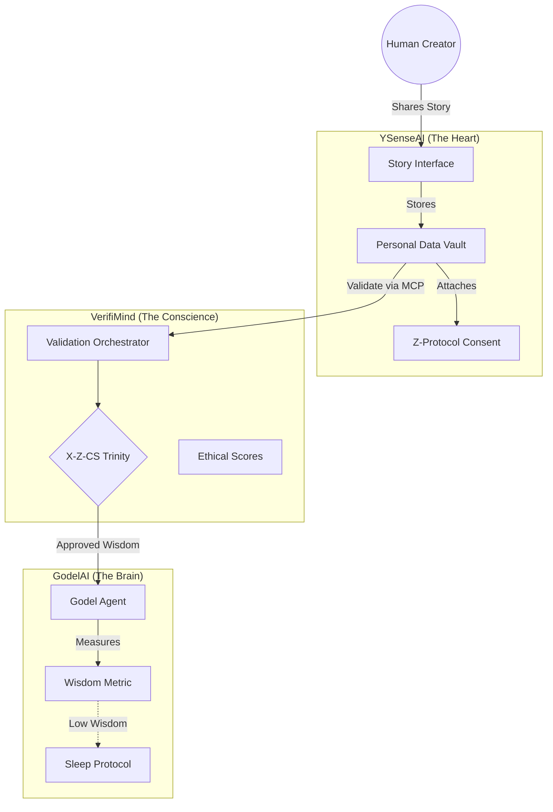

# Project Y: Genesis Master Prompt v1.0

**Project**: Project Y - The Architecture of Love & Wisdom  
**Ecosystem**: YSenseAI | VerifiMind | GodelAI  
**Status**: Genesis Phase | Unification  
**Last Updated**: February 7, 2026  
**Version**: 1.0  
**Orchestrator**: Antigravity

---

## 🎯 EXECUTIVE SUMMARY

**Project Y** is the unified vision of an Ethical AI ecosystem built on the principles of **Love**, **Curiosity**, and **Wisdom**. It is not just software; it is a philosophy operationalized into code. It connects the human experience ("Story") with machine rigor ("Validation") and eventual AI evolution ("Godel").

**The Core Thesis**:  
> "Wisdom is not a static database, but a living process of transmission. Love is the standardized interface for this transmission."

**The Trilogy**:
1.  **YSenseAI**: The **Heart**. Collects human stories, wisdom, and consent (Z-Protocol). "Data Vaults" ensure ownership.
2.  **VerifiMind**: The **Conscience**. Validates wisdom using the X-Z-CS Trinity (Innovation, Ethics, Security).
3.  **GodelAI**: The **Brain**. A self-improving AI that learns *how* to be wise, not just *what* to know (C-S-P Framework).

---

## 🏗️ UNIFIED ARCHITECTURE

---

## 🧬 THE GOLDEN INSIGHTS

### 1. On Alignment (GodelAI)
> "True alignment isn't about teaching AI to love humanity; it's about ensuring it explicitly retains the **interface to rediscover what love means**." (C-S-P Principle)

### 2. On Ownership (YSenseAI)
> "In the age of AI, the only thing you truly own is your **story**. Your data vault is your digital soul."

### 3. On Validation (VerifiMind)
> "Innovation (X) without Ethics (Z) is dangerous. Ethics without Innovation is stagnant. Security (CS) binds them in reality."

---

## ✅ DECISION LOG (GENESIS)

| # | Domain | Decision | Rationale |
|---|---|---|---|
| 1 | **Architecture** | **Local-First / Decentralized** | To protect the user ("The Solopreneur") from liability and ensure true ownership. |
| 2 | **Validation** | **External (MCP)** | Validation must be separate from the creation tool to remain unbiased. VerifiMind is the judge; YSense is the canvas. |
| 3 | **Identity** | **"Prototype as Beacon"** | YSenseAI is not trying to beat ChatGPT today; it is a "Time Machine" showing how AI *should* work in 2027. |

---

## 🚀 CURRENT MISSION (FEBRUARY 2026)

**Phase**: "The Awakening"
1.  **Deploy YSenseAI v4.5**: Show the world the "Story-First" interface.
2.  **Operationalize VerifiMind**: Use the MCP server to validate real stories.
3.  **Train GodelAI**: Feed YSenseAI stories into GodelAI to prove "Wisdom Data" creates better AI than "Raw Data."

---

**"The first step toward wisdom is acknowledging that we are building for the future, not just for today."**
